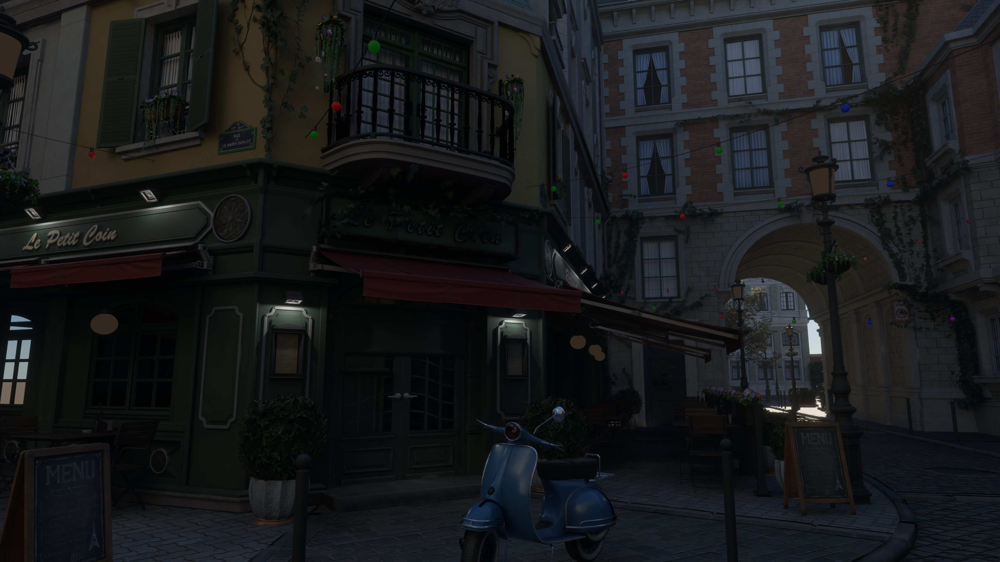
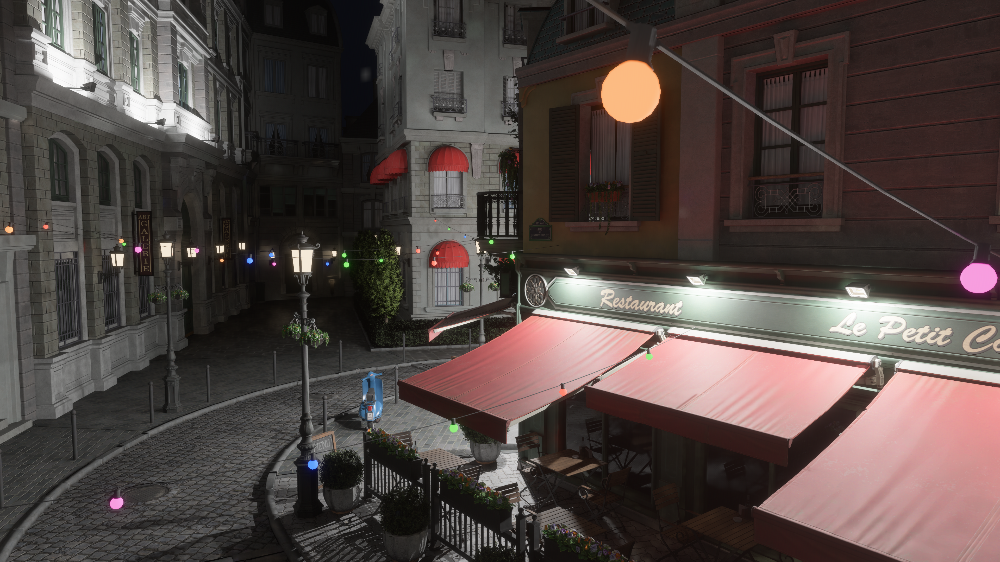

# bevy_solarik

Ray-traced lighting for Bevy 0.19.1. This is a fork of Bevy's experimental `bevy_solari` renderer with sky lighting, point and spot lights, alpha-tested foliage, and a reference pathtracer that accumulates properly.

It keeps Solari's ReSTIR direct and indirect lighting and world-space radiance cache. DLSS Ray Reconstruction is available through the optional `dlss` feature.

Tested on Windows with an RTX 4090 and Vulkan. Other hardware and backends are untested.

[Releases](https://github.com/AlrikOlson/bevy_solarik/releases) · [Changelog](CHANGELOG.md) · [Contributing](CONTRIBUTING.md)

## Bistro in Solarik





Native 4K captures from the September 6, 2026 development renderer, with DLSS
Ray Reconstruction. These include colored glass shadows, GI transmission and
analytic-light reflections; they show development code beyond the `v0.1.0` tag.
Capture settings and source provenance are in [the capture record](docs/readme-captures.md).
The night image retains shadow blotching and foliage softness after 2,048
warm-up frames; see the [capture audit](docs/pathtracer-convergence.md).
The camera exposure and lights use the scene preset; the rig's extra contrast
and saturation boost is disabled. No DLSS 5 Neural Rendering is applied.

Scene: [Amazon Lumberyard Bistro, via NVIDIA ORCA](https://developer.nvidia.com/orca/amazon-lumberyard-bistro),
[CC BY 4.0](https://creativecommons.org/licenses/by/4.0/), using the
[qian-o glTF conversion](https://github.com/qian-o/GLTF-Assets).
The local import converts materials/textures, rescales geometry, adds lamp
lights and foliage transmission, and uses a procedural sky.

## What changed

- Rays that leave the scene can pick up light from a sky cubemap.
- Point and spot lights use Bevy's light units and falloff.
- Alpha masks let rays pass through gaps in leaves. Authored double-sided masked leaf transmission is supported by the reference pathtracer and primary-foliage realtime pass.
- Development builds resolve [tinted thin glass](docs/glass.md) in reference, realtime camera and glossy paths. Camera panes replace their raster draws when ready. Opaque walls behind glass block the distant background even when raster culling omits them. Direct-light shadows and GI connections include straight pane tint and Fresnel loss.
- The reference pathtracer keeps accumulating while the camera is still.
- Light selection favors brighter lights and larger emitters. This reduced reference-render noise in the Bistro tests; it did not measurably improve the raw realtime output.

The [lighting notes](docs/lighting.md) cover the implementation and tradeoffs. The [light-sampling measurements](docs/light-sampling.md) include the results and their limits.

## Usage

Use the tagged version with Bevy 0.19.1. This example enables DLSS Ray Reconstruction; see the SDK requirements below.

```toml
[dependencies]
bevy = { version = "0.19.1", features = ["dlss"] }
bevy_solarik = { git = "https://github.com/AlrikOlson/bevy_solarik", tag = "v0.1.0", features = ["dlss"] }
```

```rust,ignore
use bevy::prelude::*;
use bevy_solarik::prelude::*;

fn main() {
    App::new()
        .add_plugins(DefaultPlugins)
        .add_plugins(SolarikPlugins)
        .add_systems(Startup, setup)
        .run();
}

fn setup(mut commands: Commands) {
    commands.spawn((
        Camera3d::default(),
        SolarikLighting::default(), // pulls in Hdr and the prepasses it needs
        Msaa::Off,
        bevy::anti_alias::dlss::Dlss::<bevy::anti_alias::dlss::DlssRayReconstructionFeature> {
            perf_quality_mode: bevy::anti_alias::dlss::DlssPerfQualityMode::Dlaa,
            reset: false,
        },
    ));
    // every mesh that should be lit, and light others, also needs RaytracingMesh3d
}
```

To add a sky, insert `SolarikSkyLight` with a loaded cubemap handle. Its values should use the same radiance units as the scene:

```rust,ignore
commands.insert_resource(SolarikSkyLight {
    image: Some(sky_cubemap),
    intensity: 1.0,
});
```

Meshes need exactly `POSITION`, `NORMAL`, `UV_0` and `TANGENT` with u32 indices to go into the ray-traced scene; anything else stays raster-only. The camera's `Msaa` has to be off. `SolarikLighting::reset` drops the temporal history for one frame on a camera cut. `SolarikPlugins::required_wgpu_features()` is what the GPU has to support; if it does not, the plugins log a warning and do nothing.

Imported glTF may need its u16 indices converted to u32 and tangents generated first. The larger scene tests use a separate local rig that is not included in this repository. Solarik and [bevy_dlss5](https://github.com/AlrikOlson/bevy_dlss5), the DLSS 5 Neural Rendering plugin, can share one NGX instance; the two plugins are separate repositories.

## Requirements

- A GPU with Vulkan ray query support. `SolarikPlugins::required_wgpu_features()` lists the required features.
- Bevy 0.19.1. Use this crate in place of `bevy_solari` in your app; there is no `[patch]` step.
- A zstd decoder for Bevy's KTX2 lookup tables. The default `zstd_rust` feature supplies one. For the C decoder, use `default-features = false` and enable `zstd_c`.
- For the optional `dlss` feature: `DLSS_SDK`, `VULKAN_SDK` and libclang at build time, plus `nvngx_dlssd.dll` next to the executable. Without it, the output is raw ReSTIR lighting with no denoiser.

## Known limits

- The deferred rendering path is required. Authored double-sided masked diffuse transmission is supported by the reference pathtracer and a bounded primary-foliage realtime pass. See [foliage setup and validation](docs/foliage.md).
- An emissive mesh can have at most 65,535 triangles. The scene can have at most 65,535 light sources in total.
- The first realtime GI bounce importance-samples the sky cubemap with hemisphere MIS. The world cache and specular paths retain their existing sampling. See [measurements and limits](docs/sky-sampling.md).
- Alpha testing adds GPU work. Thin glass transport applies to pathtracer camera/BSDF rays and realtime glossy paths; primary panes composite after opaque lighting. Reference and realtime direct-light shadows and GI connections include pane tint and Fresnel loss. Smooth reflections see finite point/spot spheres and directional disks. Rough/volumetric refraction remains unsupported.
- This is still an experimental renderer. Check the reference pathtracer when judging lighting changes.

## Building

From a standalone clone:

```text
cargo fmt --all -- --check
cargo check --workspace --all-targets
cargo nextest run --workspace
cargo clippy --workspace --all-targets -- -D warnings
```

`cargo nextest` is a separate test runner; `cargo test --workspace` also works. A clone uses its own `target/` directory. Set `CARGO_TARGET_DIR` if you want to share a build cache.

## Credits and license

Originally based on `bevy_solari` 0.19.1 by JMS55 and the Bevy contributors. Solarik is developed independently under its [own contribution and validation criteria](CONTRIBUTING.md). The [historical source comparison](docs/upstream-0.19.1.diff) is an archived provenance snapshot and is not maintained as a current diff.

Licensed under [MIT](LICENSE-MIT) or [Apache-2.0](LICENSE-APACHE), your choice.
