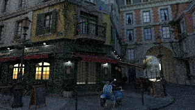
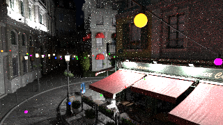

# Bistro capture convergence audit

September 6, 2026, RTX 4090, Vulkan, driver 591.86. These measurements use
Solarik's own reference pathtracer. The renderer is based on `cc1ca83` with
the sample-count diagnostic change in this record; the separate local
`bevy-sponza` rig adds capture pose logging and `tools/convergence_audit.py`.

## What a saved sample count means

The old diagnostic mapped sample count to grayscale divided by 512 and
camera exposure. Clipping and display conversion made it unsuitable for
checking long accumulations. The diagnostic now writes a 24-bit integer
into the screenshot's RGB bytes: `R + 256*G + 65536*B`. It saturates at
16,777,215. Use an sRGB target with all postprocessing disabled. The GPU
test checks zero, byte boundaries, long counts and saturation through
the production encoding function and an independent CPU sRGB conversion.

At 320×180, every one of the 57,600 saved pixels decoded to **2,049** after
2,048 warm-up frames, both at the normal frame-140 camera and the fixed
frame-400 override. The screenshot includes the capture frame's sample.
This rules out a one-sample reset or a late-readback camera change as the
explanation for those particular saved images. It does not certify every
historical capture or imply that later frames of a moving shot accumulate.

A second frame-400 diagnostic at 8,192 warm-up frames decoded to exactly
**8,193** in all 57,600 pixels, verifying the long-count encoding in a saved
full-renderer screenshot as well as in the GPU fixture.

The rig freezes timeline and camera during warm-up, requests the screenshot
at that pose, then advances while readbacks flush. It now logs timeline,
warm-up length, transform and lens for each requested PNG. Use those records
with the count image; a later `transform changed=true` flush log is not
evidence that the earlier screenshot has reset.

## Reproduction

From the separate local rig, after `cargo build --release --locked`:

```bash
SCENE=bistro SCENE_PATHTRACE=1 SCENE_LINEAR=1 NR_RES=320x180 \
  NR_START=140 NR_CAPTURE=1 NR_WARMUP=2048 \
  SOLARIK_PATHTRACER_DEBUG_SAMPLE_COUNT=1 NR_OUT=frames_count ./capture.sh off
python tools/convergence_audit.py frames_count/seq_0000.png --counts --expected 2049

# Repeat without the diagnostic at warm-ups 128, 512, 2048 and 8192,
# using a fresh output directory for every run and frame 140 or 400.
SCENE=bistro SCENE_PATHTRACE=1 SCENE_LINEAR=1 NR_RES=320x180 \
  NR_START=140 NR_CAPTURE=1 NR_WARMUP=8192 NR_OUT=frames_reference ./capture.sh off
```

Preserve `run/log_bistro_off.txt` beside each PNG before the next run
overwrites it. Captures and builds must run sequentially on this machine.

## Interpretation limits

All four day logs match timeline 140, position `(-10.5, 1.7, -1)`, rotation
`(-0.056789324, 0.7372272, -0.0624548, -0.670351)`, FOV 50 degrees,
sun 32 degrees and EV100 11.74. All four night logs match the frame-400
pose below, sun -10.7 degrees and EV100 5. The following errors compare
each render with the 8,192-warm-up render at the same pose:

| Timeline | Warm-up | RMSE | Unclipped RMSE | Clipped fraction of comparison pair |
|---|---:|---:|---:|---:|
| 140 | 128 | 0.096784 | 0.070360 | 1.193% |
| 140 | 512 | 0.057328 | 0.055540 | 0.547% |
| 140 | 2048 | 0.026802 | 0.025900 | 0.517% |
| 400 | 128 | 0.223767 | 0.122829 | 14.076% |
| 400 | 512 | 0.134593 | 0.086937 | 13.601% |
| 400 | 2048 | 0.075139 | 0.058454 | 13.033% |

Error decreases with more samples, while visible noise remains at 8,192
warm-up frames. Postprocessing is disabled in every comparison, so it is
not required to produce this noise. The remaining problem is bounded to
the reference rendering/sampling output rather than a lost accumulation;
this experiment does not isolate a particular sampling strategy or prove
there is no bias. At night the longest PNG alone clips 12.253% of pixels,
so these PNGs are unsuitable as an HDR photometric oracle. A lower-exposure
or floating-point capture and repeated seeds are needed for that purpose.




The comparison script inverts sRGB and reports RMSE and clipped-pixel
fraction. It cannot reconstruct clipped HDR values or undo exposure.
Inputs must have identical camera, resolution, lighting and exposure.
The longest render is a comparison image, not ground truth. A sequence
of PNG differences is not an independent-seed variance estimate, and
convergence does not by itself establish an unbiased estimator.

[Monte Carlo integration](https://pbr-book.org/4ed/Monte_Carlo_Integration/Monte_Carlo_Basics)
explains why retained samples and remaining noise are compatible;
[path-tracer sampling](https://pbr-book.org/4ed/Light_Transport_I_Surface_Reflection/A_Better_Path_Tracer)
describes the estimator controls relevant to further investigation.

## Realtime night presentation

The README night shot was also recaptured at native 3840×2160, frame 400,
with 2,048 warm-up frames instead of 240, using Solarik realtime lighting
and DLSS Ray Reconstruction. Both runs used the same preset and exposure
(EV100 5). The new capture log confirms position `(5.889213, 4.8116617, 12)`,
rotation `(-0.036960106, 0.26411307, 0.010129027, 0.96373004)` and
46.221573-degree field of view.

The images still show dark-region blotching and soft foliage. Whole-image
display-linear RMSE between the runs is 0.0135503, with mean 0.125230
versus 0.124400. This comparison does not establish a settled GI plateau or
attribute the artifacts to any one pass. Longer warm-up alone did not
resolve the presentation problem. Realtime ReSTIR/cache history is bounded
and adaptive; it is not the reference pathtracer's ever-growing average.
The relevant local constants are GI confidence cap 8 and maximum world-cache
temporal samples 32. Do not label a long-warm-up realtime image converged
merely because a reference sample counter works.
